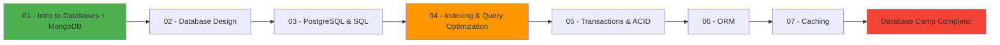

# Base Your Database 

 

 

   
   
 

**Welcome** to the repository of **Base Your Database Event**, a structured, hands-on journey into the world of databases.

This is not just about writing queries.
This is about understanding how data systems are designed, optimized, and scaled in real-world applications.

---

## Table of Content

-   [What We Cover ](#what-we-cover)
-   [Our Mission](#our-mission)
-   [Collaboration](#collaboration)
-   [What You’ll Find Here*](#what-youll-find-here)

---

## *What We Cover*

**Our journey is divided into 7 core sessions:**

|Session |	Topic |
|---------|-------|
| 01 |	Introduction to Databases + NoSQL (MongoDB) |
 02 |	Database Design (ERD & Normalization) |
| 03 |	PostgreSQL & SQL |
| 04 |	Indexing & Query Optimization |
| 05 |	Transactions & ACID |
| 06 |	ORM |
| 07 |	Caching |

## 🗺️ Visual Learning Path

From **fundamentals** → to **performance** → to **scalability**.

---

## *Our Mission*

**By the end, you should be able to:**

* Design a database properly

* Implement it using SQL

* Optimize queries

* Maintain consistency with transactions

* Use ORMs wisely

* Improve performance with caching

---

## *Collaboration*

**This event is a collaboration between:**

* Science & Technology Committee

* Backend Committee 

---

## *What You’ll Find Here*

* Session slides

* Code examples

* Hands-on exercises

* Demo projects

* documentation

---

_ **Build your base.**
_ **Optimize your structure.**
_ **Scale your systems.**